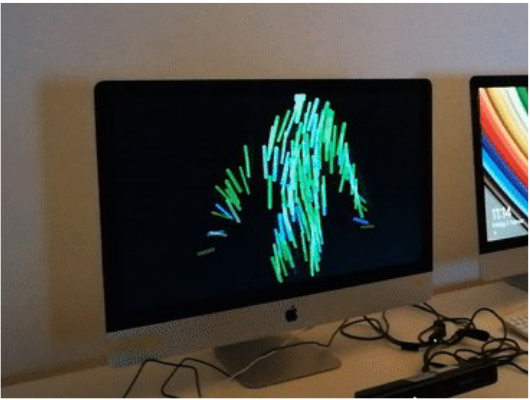
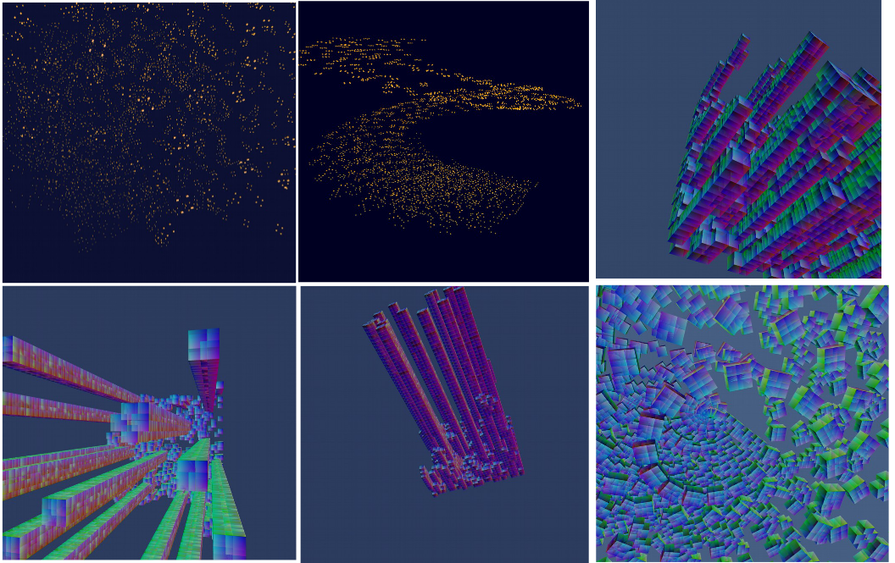

# Portfolio

## Projects completed at HBKsaar:

Project Name: Dancing Symbols\
Date: 2017\
Tools: processing, kinect\

[link](https://drive.google.com/drive/folders/16WN8cKwzarvPc1dPKG1tMs9iqw_yYcwb?usp=sharing) \
Description: My first project developed via processing. The project took the
depth map of human body captured by kinect and projected the data points on a
screen in a form of 2D strokes.

Project Name: Self-replicated City\
Date: 2018\
Tools: processing\

[Link](https://drive.google.com/drive/folders/1UqjcbIEEzXeRk3arXhVuc-Vo2iQTGpol?usp=sharing) \
Description: The project is based on Conway's Game of Life. Movement and shape
deformation were added on the top of cells evolution pattern.
